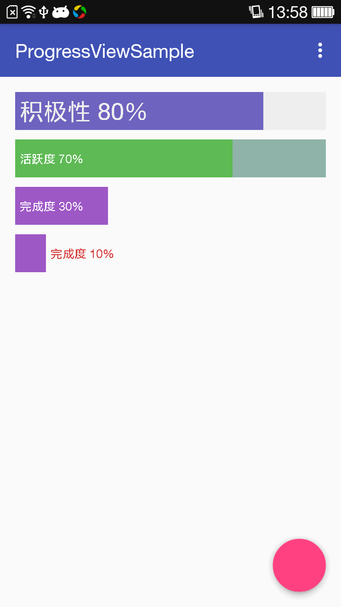

# ProgressView
简单进度条

### 截图


### 使用
1.导入依赖
```java
compile 'com.diffey.view.progressview:progressview:0.1'
```

2.布局中使用
```java
       <com.diffey.view.progressview.ProgressView
        android:layout_width="match_parent"
        android:layout_height="40dp"
        progressview:max="100"
        progressview:progress="30"
        progressview:progressColor="#9e58c6"
        progressview:text="完成度 30%"
        progressview:textColor="#fff"/>
``` 
